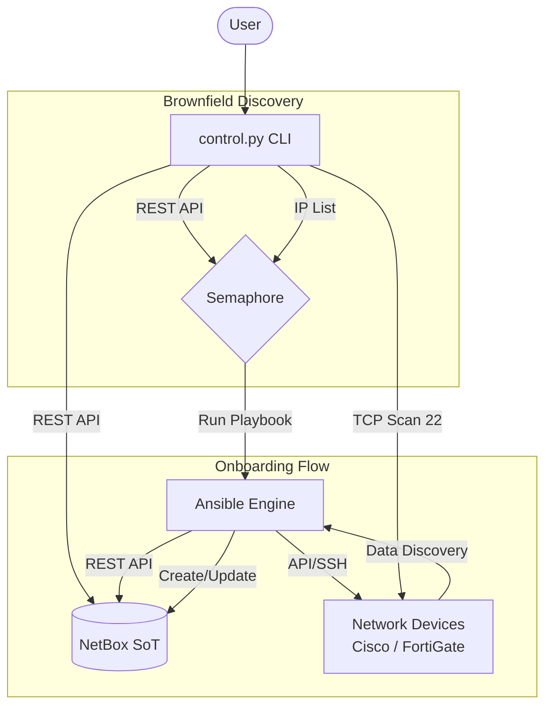
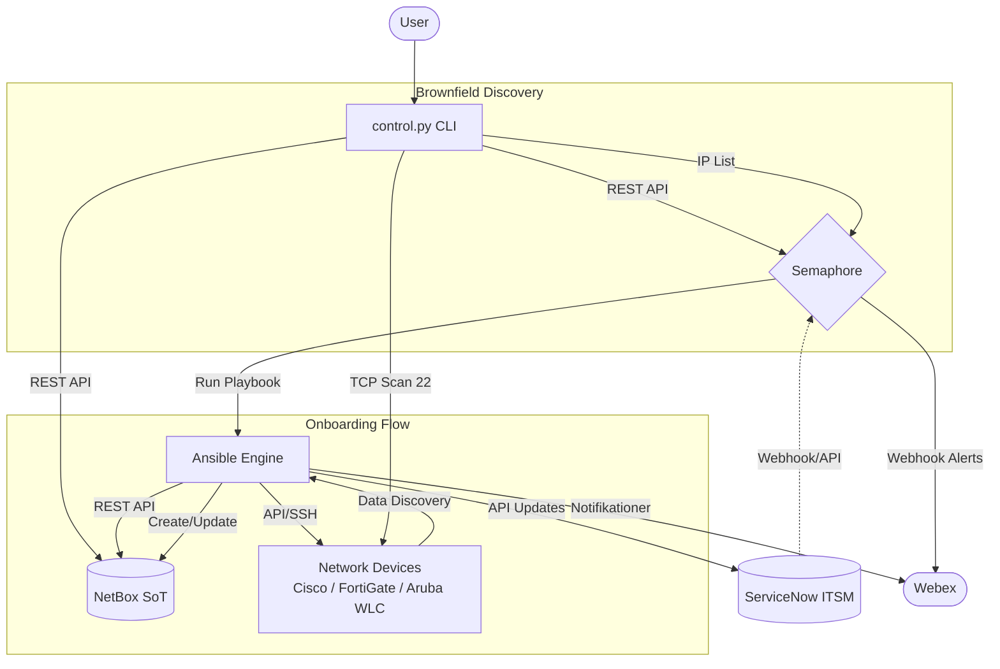

# Project Architecture - IAC-Netbox

This document describes the technical architecture and the data flow between NetBox, Ansible, Semaphore, and the Python dashboard.

## Overview

IAC-Netbox is an Infrastructure as Code (IaC) solution for network automation. It uses **NetBox** as the Source of Truth (SoT) and **Ansible** as the configuration and onboarding engine. A custom **Python CLI** provides a user-friendly interface to trigger automation tasks via **Semaphore**.

## Core Components

### 1. Source of Truth: NetBox
NetBox stores all network data, including:
- **DCIM**: Sites, Device Types, Manufacturers, Devices, Cables, and Interfaces.
- **IPAM**: VRFs, Prefixes, VLANs, and IP Addresses.
- **Custom Fields**: Used for site-specific logic (e.g., `cf_short`).

### 2. Automation Engine: Ansible
Ansible playbooks are responsible for communicating with network devices and NetBox:
- **Onboarding**: Discovers device details (hostname, serial, interfaces, IPs) from Cisco and FortiGate devices and creates them in NetBox.
- **Syncing**: Synchronizes topology (CDP neighbors) and configuration (VLANs, Cables) between the live network and NetBox.
- **Collections**: Uses `netbox.netbox`, `cisco.ios`, and `fortinet.fortios`.

### 3. Task Runner: Semaphore
Semaphore provides a REST API and a web interface to run Ansible playbooks. It manages:
- **Inventories**: Dynamic inventory from NetBox.
- **Templates**: Playbook execution definitions.
- **Secrets**: API tokens and SSH credentials.

### 4. Interactive Dashboard: Python Control Script
`control.py` is a CLI tool that:
- Connects to the Semaphore API.
- Fetches available task templates.
- Allows users to select a "Scope" (Global or specific Site).
- Performs **Brownfield Discovery** (SSH scanning).
- Triggers and monitors Semaphore tasks in real-time.

## Data Flow Diagram

## Key Workflows

### Brownfield Discovery & Onboarding
1. User selects "Brownfield Scanner" in `control.py`.
2. Script fetches prefixes from NetBox.
3. Script performs a TCP port 22 scan on the selected prefix.
4. Active IPs are sent to Semaphore.
5. Ansible playbooks connect to the IPs, gather facts, and register the devices in NetBox.

### Topology Sync
1. Ansible runs `show cdp neighbors detail` on Cisco devices.
2. Extracts neighbor information using Regex.
3. Creates **Cables** in NetBox to reflect the physical cabling.
